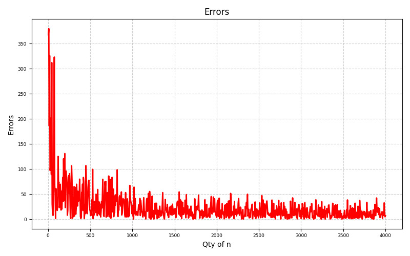

# Monte Carlo Integration of Y = 3x³ − 4x² + 7x − 18 on [−4, 6]

Hit-or-miss Monte Carlo integration of the cubic $y=3x^{3}-4x^{2}+7x-18$ on $[-4,6]$, checked against the exact antiderivative and plotted as absolute error versus sample size. Each sample count is computed ten times; the mean of those ten runs is the reported estimate.

## Problem Statement

Write a Python program that evaluates the definite integral of $y=3x^{3}-4x^{2}+7x-18$ from $-4$ to $6$ by an analytical antiderivative and by Monte Carlo integration. Plot the analytical and Monte Carlo results, and plot the error of the Monte Carlo estimate against the number of samples. For every sample size, compute the integral ten times and take the average of those ten values as the final result for that $n$.

## Project Files

| File | Description |
|------|-------------|
| `monteCarloIntegration.py` | Main script for the exact integral, hit-or-miss sampling, and plotting |
| `question.txt` | Text version of the assignment |
| `requirements.txt` | Python dependencies (numpy, matplotlib) |
| `monteCarloResult.png` | Absolute error versus number of Monte Carlo samples |

## Method Summary

This project compares a closed-form definite integral with a signed hit-or-miss Monte Carlo estimator of the same quantity.

- The integrand is evaluated on a dense grid on $[-4, 6]$ only to locate $y_{\min}$ and $y_{\max}$ for the sampling box. Those extrema define a rectangle of width $10$ and height $y_{\max}-y_{\min}$.

- The exact integral is taken from the antiderivative, not from a quadrature library.

- Monte Carlo estimates are formed by throwing uniform random points into that rectangle and scoring signed hits under the curve. For each sample size $n$, the experiment is repeated ten times and the ten estimates are averaged before the error is recorded.

**Exact integral.** The antiderivative is

$$F(x)= \int_{-4}^{6} (3x^3 - 4x^2 + 7x - 18),dx =\frac{3}{4}x^{4}-\frac{4}{3}x^{3}+\frac{7}{2}x^{2}-18x.$$

Evaluating the definite integral gives

$$I=F(6)-F(-4)=\frac{890}{3}\approx 296.6667,$$

which is the reference value used for the error curve.

**Signed hit-or-miss estimator.** Random points $(x,y)$ are drawn uniformly in $[-4,6]\times[y_{\min},y_{\max}]$. The $n$ trials are split between the positive and negative vertical strips in proportion to strip height:

$$ n_{+}=\mathrm{round}\left(n\frac{y_{\max}}{y_{\max}-y_{\min}}\right),\qquad n_{-}=\mathrm{round}\left(n\frac{-y_{\min}}{y_{\max}-y_{\min}}\right). $$

A point in the positive strip scores $+1$ when $0<y\le f(x)$. A point in the negative strip scores $-1$ when $f(x)\le y<0$. With bounding area $A=10(y_{\max}-y_{\min})$ and $N_{+}$, $N_{-}$ the signed hit counts,

$$\hat{I}_{n}=\frac{N_{+}+N_{-}}{n}\cdot A.$$

This is the geometric form of the naive Monte Carlo rule $Q_{N}=V\langle f\rangle$: the hit fraction estimates the signed area ratio, and multiplying by the known box area recovers the integral.

**Repeated trials and error.** For $n=5,10,\ldots,4000$,

$$\bar{I}(n)=\frac{1}{10}\sum_{k=1}^{10}\hat{I}_{n}^{(k)},\qquad E(n)=\left|\frac{890}{3}-\bar{I}(n)\right|.$$

The ten-run mean damps the run-to-run scatter so the error plot shows the trend with $n$ rather than a single noisy realization. As derived for Monte Carlo integration in the Wikipedia overview, the standard error of $Q_{N}$ shrinks as $V\sqrt{\mathrm{Var}(f)/N}$, that is as $1/\sqrt{N}$, independent of dimension. The plotted $E(n)$ is therefore expected to fall roughly like $1/\sqrt{n}$ as the sample count grows, with residual fluctuations because a finite average of ten runs is still random.

## Requirements
```
pip install -r requirements.txt
```

## How to Run
```
python monteCarloIntegration.py
```

## Output

**Terminal output:**

- Best Monte Carlo estimate (the ten-run mean with the smallest absolute error)
- Sample size $n$ at which that best estimate occurs

**Plots generated:**
- Absolute error $E(n)$ versus the number of Monte Carlo samples

## Sample Outputs

### Absolute errors versus the number of Monte Carlo samples


## Notes

- This project was developed as part of an academic exercise in numerical methods and probabilistic simulation: a cubic is integrated in closed form, then recovered with signed hit-or-miss Monte Carlo so that bias and the $1/\sqrt{n}$ error trend can be inspected directly.
